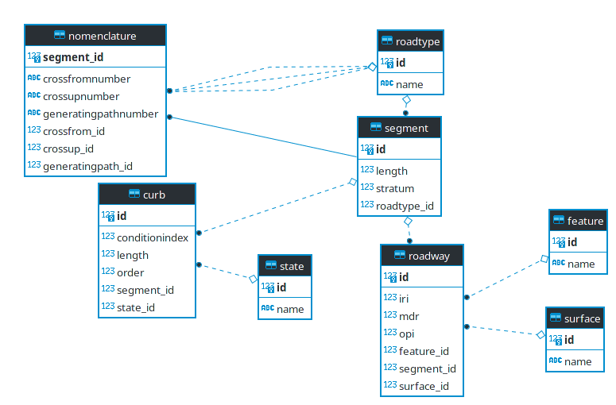

# SGVial
Prototipo de solución a raiz de la entrevista con un [cliente](interview.png) 
con el fin de desarrollar un sistema para la administración de la malla vial

Con base en la información que [recolecta el cliente](data_test.xlsx) y la entrevisa
se diseño el siguiente modelo de datos:




#Backend
[Api rest](sgvial-api) desarrollada en el framework Play Java utilizando una base de datos relacional Postgresql a travez
de Jpa y Hibernate
Instalación:
1. Ejecutar el script [ddl](sgvial-api/dml.sql) 
2. Ejecutar el script [ddl](sgvial-api/ddl.sql)
3. En archivo [application.conf](sgvial-api/conf/application.conf) configura tu usuario, contraseña y 
puerto de base de datos
3. Ejecuta sbt run 

#Frontend
[React App](sgvial-web-app) desarrollada en framework ReactJs con librerias como redux, redux-from, immutableJs y Semantic UI
```
yarn install
yarn start
```

